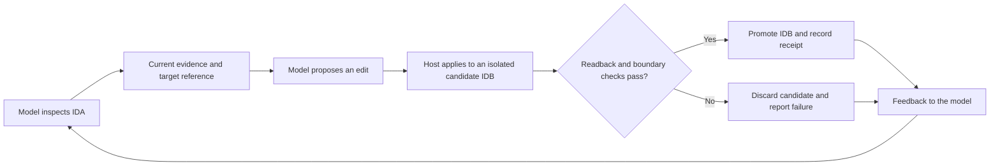

# Verified IDA

A proposed interface standard and reference harness for model-driven reverse
engineering with IDA. The model investigates the program; the host checks that
its changes reached the intended database state and preserves the evidence
needed to inspect or correct the work.

**Release candidate 0.2.0a11.** Not yet licensed for public distribution; see
[license status](LICENSE_STATUS.md). This is research software, not a guarantee
that an autonomous malware analysis is correct or exhaustive.

## The verification loop



For example, a model may rename a function but leave no explanation of its
behavior. The rename can be mechanically verified while post-edit feedback
still identifies the missing comment. The model can inspect the function again
and add that explanation. Both edits and their evidence remain in the ledger;
a fresh-process checkpoint checks that the accepted state survives reopening.

The [runnable example](examples/verified-edit/README.md) demonstrates this loop
on a harmless C program, without a model or API key. It exercises the host
contract; it does not pretend to demonstrate autonomous reasoning.

## What is standardized

- Evidence is tied to a specific component and database revision.
- Edits have explicit targets, requested state, outcomes, and repair information.
- Tool success, durable application, and analytical correctness are separate.
- Accepted analysis lives in IDA; operational provenance lives in the ledger.
- Completion reports distinguish verified state from unresolved work.

This is an IDA-specific proposal, not an industry-adopted standard or a claim of
compatibility with other disassemblers. The reference runner uses the OpenAI
Agents SDK. Another model runner or backend needs its own tested adapter.

Read [the standard](docs/standard.md) for requirements and
[the architecture](docs/architecture.md) for the implementation map.

## Install

The validated full-analysis environment is Linux, Python 3.10 or 3.12, IDA Pro
9.3 with Hex-Rays, and working `unshare`, `bwrap`, GNU `timeout`, and
`libseccomp.so.2`. You supply the IDA license. macOS support is limited; the
restricted extraction path requires Linux.

```sh
python3 -m venv .venv
. .venv/bin/activate
python -m pip install -c constraints.txt -e .
verified-ida --help
```

Use the source tree with an editable install; a standalone wheel is not a
supported deployment. Repository-owned workers, prompts, and schemas are
required. Set `IDA_PATH` to your installation directory and supply
`OPENAI_API_KEY` through your environment before a model run. Do not commit
credentials. `.env.example` documents variables; `.env` is not auto-loaded.

## Investigate and review

Use an isolated analysis machine and a clean IDB whose loader-recorded input
hash matches the sample. Keep output outside the source tree.

```sh
verified-ida analyze \
  --sample /analysis/input/sample.bin \
  --clean-idb /analysis/input/clean.i64 \
  --project-dir /analysis/output/investigation \
  --model YOUR_AVAILABLE_MODEL

verified-ida review \
  --source-project-dir /analysis/output/investigation \
  --run-dir /analysis/output/review \
  --model YOUR_AVAILABLE_MODEL
```

Review is an explicit second command. It inspects disposable copies and returns
validated findings to the saved investigation session for verified application.
The primary project's databases remain unchanged by independent review.

The outputs are the annotated component IDBs, `verified_ida.sqlite` operation
ledger, `reversing_log.md` notebook, observable tool traces, and summaries.
See [usage](docs/usage.md) for inputs, resumption, budgets, exports, and status
interpretation. IDBs contain sample bytes: treat them as sensitive artifacts.

## Repository map

| Path | Purpose |
| --- | --- |
| `src/verified_ida/` | CLI, model tools, transactions, ledger, feedback, continuity, review |
| `src/*.py` | Shared IDA and static-extraction support |
| `scripts/` | Trusted IDA workers, isolation launchers, export and packaging utilities |
| `prompts/` | Actual model-facing investigation and review guidance |
| `schemas/verified_ida/` | Canonical operation, batch, and receipt contracts |
| `docs/` | Standard, architecture, usage, validation and limits |
| `examples/verified-edit/` | Small executable demonstration of the host contract |

Historical experiments, full regression suites, private fixtures, and release
repair diaries are maintained separately, not included in this public candidate.

## Limits and safety

Mechanical verification cannot prove that a name, comment, or recovered type
correctly describes the malware. Some type changes cannot be verified if a
required caller fails to decompile. Missing external payloads can leave a review
analytically incomplete even after all available findings are processed.

Optional coverage reconciliation and selected direct-call enforcement remain
experimental; they do not enforce analysis of every function or indirect call.
IDA workers are isolated from the network in the supported configuration. The
harness does not launch the sample or recovered executables; bounded instruction
emulation is a separate static-analysis facility. Isolation is not proof against
IDA, Python, or operating-system vulnerabilities.

Read [security](SECURITY.md) and [validation and limitations](docs/validation.md)
before using the harness with untrusted input.
