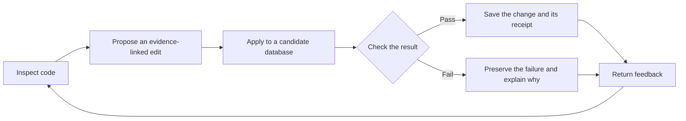

# Verified IDA

Verified IDA is a research harness for model-led reverse engineering. It helps
a model investigate a program and record its understanding in IDA: function
names and comments, interfaces, shared types, and relationships between
components. The goal is a database that preserves what the investigation
established and what remains uncertain.

The project grew out of our studies of model-led malware analysis. We saw useful
findings left in conversation logs, annotations that overstated what the code
did, and tools reporting success without enough information to check the result.
Verified IDA defines a common contract for those operations and records the
evidence, requested changes, and checked results.

## How it works

The model chooses what to investigate and proposes changes. The host—the code
that mediates access to IDA—identifies the target, requires current evidence,
applies the edit to a candidate database, and checks the result. It returns
feedback and records the operation in a ledger. Accepted changes become part
of the working IDB.

During longer investigations, a project notebook preserves the current
understanding and open questions as the model reduces its conversation context
or moves into an embedded binary. A separate review command checks claims and
looks for gaps, then returns findings to the saved investigator for correction.

## Worked example

[Applying a recovered type](docs/worked-example.md) follows one ComRAT function
from an anonymous parameter to a named structure field. The walkthrough shows
the code before and after, the feedback sent to Sol, and the checks recorded
when the change was saved.

## What the proposed standard covers

The [interface specification](docs/standard.md) defines how a model identifies
evidence, requests edits, receives verification results, and tracks unfinished
work. It also defines requirements for enforcing a selected investigation
scope. The harness is the IDA reference implementation of that proposal;
support for another disassembler would require a validated adapter.

Verification establishes what changed in the database and whether it persisted.
The interpretation can still be wrong, and reviewers can miss errors. The saved
evidence and unresolved questions allow those judgments to be revisited.

## Start here

| If you want to… | Read |
| --- | --- |
| Install, investigate a binary, review or resume a project | [User guide](docs/usage.md) |
| Understand the contracts or find their implementation | [Interface specification and code map](docs/standard.md) |
| Assess isolation and data-handling requirements | [Security](SECURITY.md) |

You supply the IDA license and model access. The user guide describes the
[supported environment and installation](docs/usage.md#requirements-and-installation).

## License

[MIT](LICENSE). IDA and third-party dependencies retain their own license terms.
