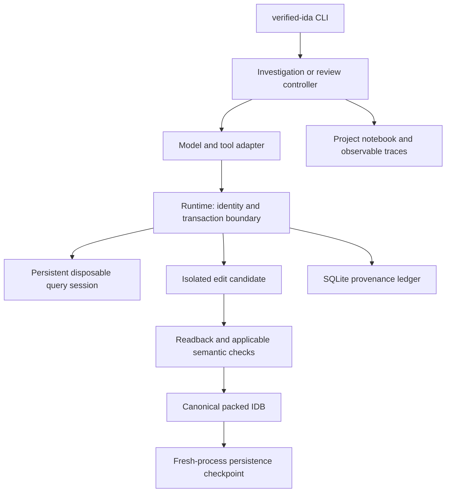
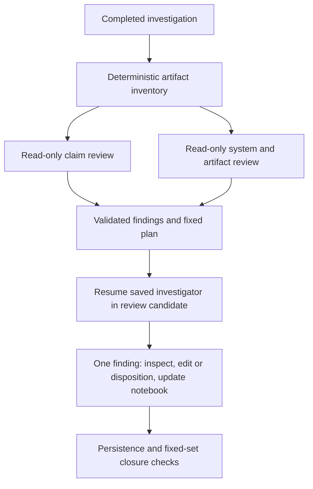

# Architecture and code map

The reference runtime uses serialized IDA access. Nexus and concurrent writers
are not part of this release. The model runner is the OpenAI Agents SDK, not
the Codex SDK; IDA access is through repository-owned workers, not an MCP server.

## Where to start reading

Paths below are relative to `src/verified_ida/` unless stated otherwise.

| Component | Files | Responsibility |
| --- | --- | --- |
| CLI and campaigns | `cli.py`, `commands/` | Start/resume, budgets, review collection/application and finalization |
| Model interface | `model_tools.py`, `adapter.py`, `query_contract.py` | Discoverable tools and typed dispatch |
| Trusted host | `runtime.py` | Live identity, permissions, candidate edits, feedback and checkpoint orchestration |
| IDA lifecycle | `session.py`, `project_lock.py` | Exclusive project ownership and disposable worker processes |
| Canonical contract | `contracts.py`, `canonical.py` | Validate operations and compare requested/observed representations |
| Change verification | `semantic_delta.py`, `transaction_recovery.py` | Classify effects and recover interrupted promotion |
| Ledger | `journal.py` | Durable inspections, targets, operations, attempts, revisions, findings and decisions |
| Feedback | `analysis_feedback.py`, `frontier.py` | Operation-specific consequences and required/advisory work |
| Continuity | `workspace.py`, `session_context.py`, `model_context.py`, `prompting.py` | Notebook, saved sessions, request context and guidance |
| Components | `components.py`, `src/component_extraction.py` | Recover bytes and connect separate parent/child IDBs |
| Review | `final_review.py`, `review_application_state.py`, `reconciliation.py` | Isolation, exact findings, resumable application and optional scoped review |
| Provenance and outputs | `audit.py`, `source_provenance.py`, `export_safety.py` | Observable traces, source identity and safe annotation export |

`runtime.py`, `journal.py`, and `commands/review.py` are substantial orchestration
modules. This export preserves their tested boundaries; it does not claim they
are a fully decomposed plugin architecture. Smaller support modules in `src/`
are imported by the host and workers and are not abandoned older harnesses.

## Trusted workers

The `scripts/` directory contains runtime dependencies, not a menu of alternative
harnesses. `verified_ida_session_ida.py` serves the query process;
`apply_verified_ida_operations.py` applies canonical operations;
`export_verified_ida_semantic_state.py` implements the shared semantic exporter.
`export_verified_ida_semantic_snapshot_ida.py` exposes that exporter to standalone
safe export. `verify_verified_ida_persistence.py` checks saved receipts on reopen.

The shell launchers enforce the supported isolation boundary. IDAPython scripts
must not be run unsandboxed against valuable original IDBs. Static extraction
has a separate restricted Python/seccomp path; it is not arbitrary shell access.

## Review sequence

The final-review command is explicit. The optional `--coverage-reconciliation`
profile instead runs selected reconciliation before primary completion; it is
not the same stage. Reviewers receive runtime read-only permissions, not merely
a prompt asking them to avoid writes. Review application has write permission
only within its admitted targets and original operation baseline.

## State boundaries

The query process is not authoritative merely because a decompiler changed
something in memory. Accepted packed databases and their ledger revisions are
authoritative. Candidate promotion is followed by ledger commit, with recovery
state protecting the interruption between them. Periodic and closure
checkpoints reopen each affected component to verify persistence.

The notebook is model-maintained structured Markdown, not a database query
language. Saved SDK history carries conversational continuity; neither is a
substitute for live IDA checks. See [the standard](standard.md) for the exact
division between mechanical guarantees and analytical judgment.
